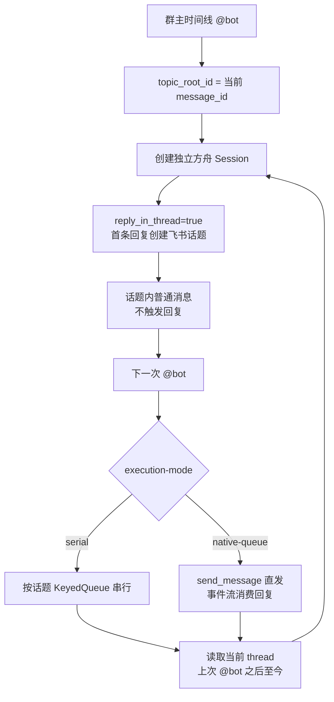
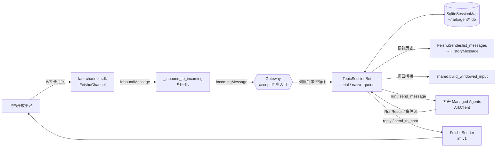
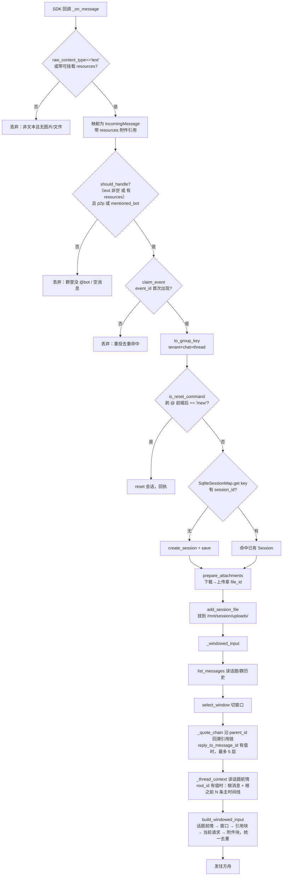
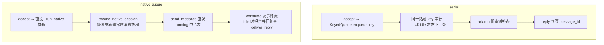
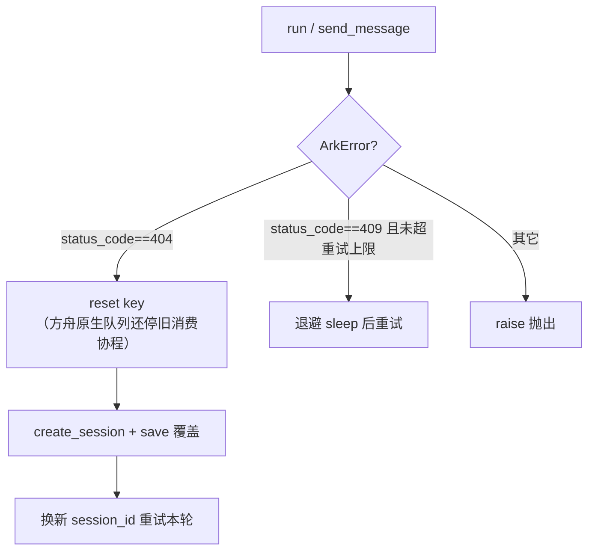
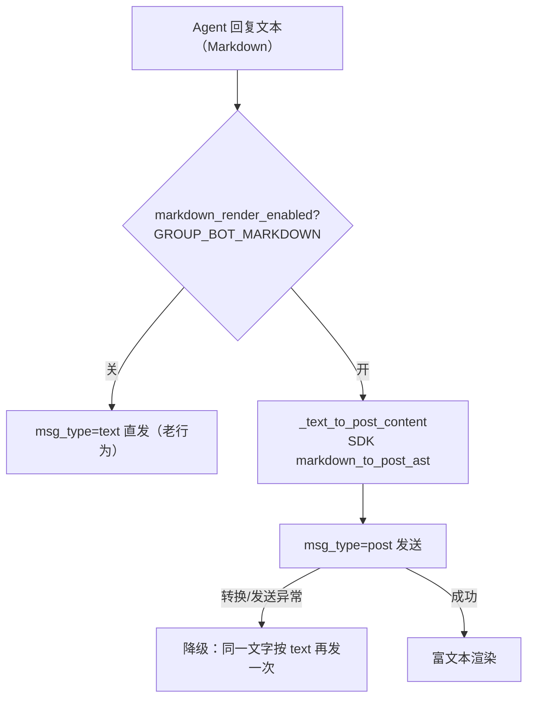

# 群聊共享 Bot：架构与数据流

这份文档回答三个问题：

1. 一条飞书消息从进来到回复，**数据是怎么流动的**（架构图 / 时序图）。
2. 流程里有哪些**关键数据结构**，各自装了什么。
3. 每个**判断节点依据对象的哪个属性**做决策。

代码入口：`shared.py`（公共底座）、`topic_session_bot.py`（话题级 Session，支持
`serial` / `native-queue`）、`../../arkagent/feishu.py`（飞书接入 + 归一化）、
`../../arkagent/ark.py`（方舟客户端）、`../../arkagent/gateway.py`（`KeyedQueue`）。

> 术语：**触发消息** = 当前这条 @bot 的入站消息；**窗口** = 注入本轮的那段群历史增量。

---

## 1. 关键数据结构

| 结构 | 定义位置 | 作用 | 关键字段 |
|---|---|---|---|
| `IncomingMessage` | [feishu.py:26](../../arkagent/feishu.py) | **单条入站消息的归一化契约**（接入层→业务的防腐层） | `event_id`（去重）、`chat_id`/`thread_id`/`tenant_key`（分桶）、`chat_type`、`mentioned_bot`（是否处理）、`message_id`（回复/筛历史）、`text`、`create_time`（窗口排序/截断）、`user_open_id`、`user_name`（发言人显示名→转录当前请求行，取不到回退 open_id）、`reply_to_message_id`（显式引用的消息 id→引用链）、`root_id`（话题根消息 id→话题前情）、`resources`（图片/文件附件→多模态挂载） |
| `HistoryMessage` | [feishu.py:64](../../arkagent/feishu.py) | 一条**群历史**消息归一化后的结果，比入站多两个语义判定位 | `at_bot`（切窗口边界）、`is_from_bot`（过滤 bot 回复）、`create_time`（升序）、`sender_name`（转录显示名，保留 `@名字`）、`text`、`resources`（这条历史消息里的图片/文件附件→收进本轮挂载） |
| `QuotedMessage` | [feishu.py:48](../../arkagent/feishu.py) | 引用链上一条**被引用消息**的归一化结果（`resolve_quote_chain` 产出） | `depth`（1=直接引用，越大越久远，封顶 `MAX_QUOTE_DEPTH`=5）、`sender_name`、`text`、`message_id`（去重用） |
| `ResourceRef` | [feishu.py:26](../../arkagent/feishu.py) | 一条消息里一个**可下载附件**（图片/文件）的引用（`_extract_resources` / `_extract_history_resources` 产出） | `file_key`（下载键）、`file_name`（清洗后作挂载名）、`type`（`image`/`file`，其它类型不挂）、`message_id`（附件所属消息 id，下载资源必须按各自所属消息取；空则由调用方用当前消息 id 兜底） |
| `PreparedAttachment` | [shared.py](shared.py) | 一个已上传、待挂载的附件 | `file_id`（方舟文件 ID）、`mount_path`（相对 `/mnt/session/uploads/`）、`name`（提示/错误用）、`file_key`（去重身份） |
| `GroupConversationKey` | [shared.py:35](shared.py) | 共享会话键，**刻意不含 user_open_id** | `tenant_key` + `chat_id` + `thread_id` → `as_str()` = `"t:chat:thread"` |
| `SqliteSessionMap` | [shared.py:343](shared.py) | 群 key → 方舟 session_id 的**持久化映射** + 事件去重 + 附件两层去重，跨重启不丢 | 表 `sessions(key, session_id)`、`seen_events(event_id)`、`attachments(file_key, file_id)`（文件缓存·跨 session）、`attachment_mounts(session_id, file_key)`（挂载记录·按 session） |
| `RunResult` | [ark.py:27](../../arkagent/ark.py) | 方舟一轮运行的终态结果 | `terminal`（`"idle"`/`"failed"`）、`messages` |
| `ArkError` | [ark.py:33](../../arkagent/ark.py) | 方舟异常，带**结构化状态码** | `status_code`（404=Session 失效、409=RuntimeBusy）、`body` |

---

## 2. 推荐架构：话题即 Session



`topic_session_bot.py` 只有在收到 `@bot` 时才运行和回复。此时调用
`FeishuSender.list_messages`，但容器严格限定为当前 thread，再截取
「上一次 `@bot` 之后到当前」；边界消息已在 Session 中，不会重复注入。普通消息因此进入
下一轮上下文，却不会单独触发 Bot。
它不调用 `load_thread_context`，也不读取主群时间线或其他话题。

话题键优先使用 `root_id`，其次 `thread_id`；首条主时间线消息尚无这两个字段时使用自身
`message_id`。飞书后续话题消息的 `root_id` 会回指该根消息，因此进程重启后仍可从 SQLite
恢复同一 Session。`@bot /new` 会立即为当前话题创建替代 Session，不删除话题归属。

---

## 3. 总体架构



出站与入站共用同一个 SDK：入站走 `FeishuChannel`（WS + 归一化 + 去重 + 策略），
出站走 SDK 自带的同步 `Client`（`FeishuSender`）。

---

## 4. 入站数据流与判断节点



### 判断节点 → 依据属性 一览

| # | 判断节点 | 代码位置 | 依据属性 | 命中后的动作 |
|---|---|---|---|---|
| 1 | 是否可处理消息 | `_inbound_to_incoming` [feishu.py:290](../../arkagent/feishu.py) | `raw_content_type == "text"` **或** `_extract_resources` 抽到了图片/文件 | 都没有则返回 None、丢弃；image/file 消息清空占位 `text`、把附件挂到 `resources` |
| 2 | 是否处理这条 | `should_handle` [shared.py:59](shared.py) | （`text` 非空 **或** `resources` 非空）**且**（`chat_type=="p2p"` **或** `mentioned_bot`） | 群里没 @bot、或既无正文又无附件直接丢 |
| 3 | 事件去重 | `claim_event` [shared.py:410](shared.py) | `event_id`（SQLite 主键唯一约束原子占位） | 重投则丢，跨重启仍生效 |
| 4 | 会话分桶 | `to_group_key` [shared.py:51](shared.py) | `tenant_key` + `chat_id` + `thread_id` | 决定共享哪个 Session；**话题独立成桶** |
| 5 | 指令分流 | `_process`/`_handle` | `is_reset_command(text)`（剥掉开头 @提及前缀后 == `/new`；群里 @bot 正文带 `@群助手 ` 前缀，直接严格相等永不命中） | 重置本群会话 |
| 6 | 是否已有 Session | `SqliteSessionMap.get` [shared.py:391](shared.py) | `key.as_str()` | 无则 `create_session` |
| 7 | 附件上传 | `prepare_attachments` [shared.py](shared.py) | 所有文件类型统一上传；超 20 MB / 单轮 40 MB / 下载失败降级为 notice | 填 `file_id` 待挂载 |
| 8 | 历史容器选择 | `list_messages` [feishu.py:240](../../arkagent/feishu.py) | `thread_id` 非空 → `thread` 容器；否则 → `chat` 容器（且用 `end_time` 截到当前） | 决定拉哪条时间线的历史 |
| 9 | 历史项筛选 | `_is_eligible_history` [feishu.py:424](../../arkagent/feishu.py) | `message_id != trigger.message_id` **且** `0 < create_time <= trigger.create_time` | 排除触发消息本身、排除并发到达的"未来"消息 |
| 10 | at_bot / is_from_bot | `normalize_history_item` [feishu.py:436](../../arkagent/feishu.py) | `mentions[].id == bot_open_id` / `sender_type=="app"` 或 `sender_open_id==bot_open_id` | 给历史项打上切窗/过滤标记 |
| 11 | 窗口边界 | `select_window` [shared.py:145](shared.py) | 历史项的 `is_from_bot`（先滤掉）、`at_bot`（取最近一条作为窗口起点） | 无 at_bot 时回退最近 `FALLBACK_WINDOW_MESSAGES`(10) 条 |
| 12 | 是否解析引用链 | `_quote_chain` → `resolve_quote_chain` [feishu.py:399](../../arkagent/feishu.py) | `reply_to_message_id` 非空（SDK 仅在 `parent_id != root_id` 即用户显式引用时填） | 沿 `parent_id` 逐层 `get_message`，最多 `MAX_QUOTE_DEPTH`(5) 层，`seen` 防环 |
| 13 | 是否补话题前情 | `_thread_context` → `load_thread_context` [feishu.py:337](../../arkagent/feishu.py) | `root_id` 非空（话题群才有） | 读根消息 + 根之前 `THREAD_CONTEXT_BEFORE`(3) 条主时间线，thread 容器读不到故单独补 |
| 14 | 转录去重 | `build_windowed_input` [shared.py:196](shared.py) | `message_id` 是否已在 `seen_ids`（话题前情/窗口/引用共用一个集合） | 已出现过的不再重复注入 |

窗口规则的语义：「倒数第一次 @bot」= 当前触发消息（不在历史里）；「倒数第二次 @bot」
= 历史里**最近一条** `at_bot`。从它到现在，正好是上一轮触发点之后、尚未喂过 Session 的增量。

拼出的 user message 是**纯对话转录**（不再有 `<conversation_context>` 等 XML 包裹），
按「话题前情 → 窗口历史 → 引用块 → 当前请求 →（多模态）附件块」拼接，转录里保留 `@名字`
（含 @bot 自己，其身份由 Agent system prompt 的 `GROUP_BOT_DISPLAY_NAME` 声明）：

```
【最新对话】
[话题前情 Alice: 上周的周报模板在这]   ← 话题群才有：根消息 + 根之前 N 条主时间线（load_thread_context）
Alice: 老板说要出周报              ← 窗口历史（select_window）
Bob: 我这边数据有了
[引用 Carol: 三季度销售汇总]        ← 当前这条显式引用别的消息时注入，嵌套层标 [引用·第N层]
David: @群助手 整理成周报发我        ← 当前 @bot 的请求（无显示名时用 open_id 兜底；纯图片消息给默认指令）
【文件挂载】
报告.pdf： /mnt/session/uploads/9f3a…/报告.pdf
```

前四段共用一个 `seen_ids`，同一 `message_id` 只出现一次（如引用的消息已在窗口里则不重复注入）；
附件块由 `_attachment_blocks` 追加在当前请求行之后，只在带图片/文件时出现。

---

## 5. 两种执行模式的分叉（发送策略 + 回复路径）



| 维度 | 客户端串行 | 方舟原生队列 |
|---|---|---|
| 排序者 | 客户端 `KeyedQueue`（[gateway.py:28](../../arkagent/gateway.py)，按 key 串行） | 方舟服务端"运行中待处理队列" |
| 是否合并 | 不会，每条独立成轮 | 会，同一可调度边界前堆积的多条被打包进一次模型请求 |
| 每人单独回复 | 是 | 不保证 |
| 回复路径 | `reply_in_thread(message_id)`，始终留在当前话题 | 事件流在 `idle` 时取最后一条 `agent.message`，`reply_in_thread` 到本回合最后一条触发消息 |
| 409 `RuntimeBusy` | 不触发 | 会，指数退避（`_is_runtime_busy` 依据 `ArkError.status_code==409`） |

> 两种模式统一由 `_reply` 依据 `chat_type=="group"` 且存在 `message_id` 决定使用
> `reply_in_thread` 或 `send_to_chat`。原生队列合并回复使用本回合最后一条触发消息作为话题锚点。

---

## 6. 兜底：Session 失效重建

持久化后，`session_id` 可能在方舟侧已过期/被清（重启后尤甚），表现为 **404**。



| 判断节点 | 位置 | 依据属性 | 动作 |
|---|---|---|---|
| Session 失效 | `_process_serial` / `_send_native` | `ArkError.status_code == 404` | 重置映射 → 重建 Session → 重跑/重发；原生模式同时重启 consumer |
| 队列忙 | `_send_native` | `ArkError.status_code == 409`（`_is_runtime_busy`） | 指数退避重试（上限 `MAX_409_RETRIES`） |
| 运行终态 | `_result_to_text` [topic_session_bot.py](topic_session_bot.py) | `RunResult.terminal` / `messages` | `failed` 报错、`idle` 取最后一条 |

`ArkError.status_code` / `body` 由 `ArkClient._request` 与事件流在 4xx 时填充
（[ark.py:86](../../arkagent/ark.py)），调用方据此精准分流，不再靠字符串匹配。

---

## 7. 持久化落点

- `SqliteSessionMap` 默认使用仓库 `data/` 下独立数据库：serial 为
  `topic_bot_sessions.db`，native-queue 为 `topic_bot_native_queue_sessions.db`（WAL 模式）。
- `sessions` 表让 gateway 重启后仍复用同一个群/话题的方舟 Session（对话记忆存在方舟侧）。
- `seen_events` 表让事件去重跨进程重启仍生效（24h TTL，启动清理一次）。
- 并发：WS 线程与事件循环线程共用连接（`check_same_thread=False`），进程内一把锁串行化写。

---

## 8. 多模态：图片 / 文件挂载 Session 文件系统

群里 @bot 时发图片/文件（含只发图不带字），bot 把附件**挂进方舟 Session 沙箱**让 Agent
用文件工具去读，对齐源项目 `src/gateway.ts` 的「上传并挂载」方案（**不**走 user message
多模态块）。开关 `GROUP_BOT_MULTIMODAL`（默认开启）。

```mermaid
flowchart TD
    R[IncomingMessage.resources\nResourceRef 图片/文件引用] --> DL[download_resource\nGET /im/v1/messages/{id}/resources/{key}]
    DL --> SPLIT{prepare_attachments}
    SPLIT -- 所有文件类型 --> UP[ArkClient.upload_file\nPOST /files purpose=agent → file_id]
    SPLIT -- 下载失败/超 20MB/单轮超 40MB --> DEG[降级为 notice\n拼进正文「另外：…」]
    UP --> MNT[ArkClient.add_session_file\nPOST /sessions/id/resources\n→ /mnt/session/uploads/短哈希/名]
    MNT --> BUILD
    DEG --> BUILD
```

| 判断/步骤 | 位置 | 依据属性 | 动作 |
|---|---|---|---|
| 抽取可挂载附件 | `_extract_resources` [feishu.py](../../arkagent/feishu.py) | `ResourceDescriptor.type ∈ {image, file}` 且 `file_key` 非空 | 映射为 `ResourceRef`；sticker/audio/video 跳过 |
| 开关 | `multimodal_enabled` [shared.py](shared.py) | `GROUP_BOT_MULTIMODAL` != `0/false/no/off` | 关闭时不下载不上传，正文留「[附件已忽略]」 |
| 上传 | `prepare_attachments` [shared.py](shared.py) | 图片、PDF、Markdown、纯文本等全部文件类型 | 上传拿 `file_id` |
| 额度/降级 | `prepare_attachments` [shared.py](shared.py) | `MAX_SINGLE_FILE_BYTES`(20MB) / `MAX_ATTACHMENT_TOTAL_BYTES`(40MB) / 下载·上传异常 | 逐个附件套 try，失败记一条 notice 跳过，不拖垮本轮 |
| 挂载路径 | `_mount_path` [shared.py](shared.py) | `sha256(file_key)[:16]` + 安全文件名 | `/mnt/session/uploads/{短哈希}/{名}`，同一 `file_key` 恒定映射到同一路径（去重基础），不同文件不覆盖 |
| 挂到 Session | `_mount_attachments` | `PreparedAttachment.file_id` 非空 | `add_session_file` 挂载；单个失败记 warning 不抛 |
| 正文注入 | `_attachment_blocks` [shared.py](shared.py) | 已挂载附件列表 | 只列沙箱路径，不展开文件原文；notice 逐条如实 |

要点：
- **附件先于发消息挂载**——正文里会给出 `/mnt/session/uploads/...` 路径，挂载必须在
  `run`/`send_message` 之前完成，否则 Agent 读路径时文件还没就位。
- **`file_id` 与 Session 无关**：Session 失效重建（404）时只需把附件重新 `add_session_file`
  到新 Session，无需重新上传。
- **统一挂载**：Markdown、纯文本、图片、PDF 等都只挂载，交给 Agent 的文件工具按需读取。
- 编排是纯函数（`prepare_attachments` / `_attachment_blocks`），两个 IO 能力（下载、上传）
  由 bot 注入，测试见 `tests/test_group_bot.py`；方舟侧接口测试见 `tests/test_ark.py`。

### 8.1 附件去重（不重复下载 / 上传 / 挂载）

同一个文件可能在多轮对话里被反复引用（多人接力、话题里反复提到同一份报告），甚至跨群/话题
出现。为避免每次都重新走一遍「下载 → 上传 → 挂载」，用**两层去重**，都挂在 `SqliteSessionMap`
（`InMemorySessionMap` 同接口）上，以飞书 `file_key`（资源稳定身份）为键：

| 层 | 表 / 方法 | 键 | 作用 |
|---|---|---|---|
| 文件缓存 | `attachments(file_key, file_id)`；`get_attachment` / `save_attachment` | `file_key`（**不含 session**） | `file_key → 方舟 file_id`。命中就**跳过下载 + 上传**，直接复用旧 `file_id`。`file_id` 与 Session 无关、可跨会话复用，故此缓存**跨群/话题/重启**共享——即用户要的「跨 session 不重复下载挂载」 |
| 挂载记录 | `attachment_mounts(session_id, file_key)`；`is_attachment_mounted` / `mark_attachment_mounted` | `(session_id, file_key)` | 记录「某资源在某 Session 是否已挂过」。同一 Session 里同一资源**只挂一次**，之后每轮引用同一路径即可，不再 `add_session_file` |

- `_mount_path` 由 `file_key` 哈希决定（不掺 `message_id`），所以同一资源不论出现在哪条消息、
  哪个 Session，都落到**同一挂载路径**——这是「文件缓存复用 `file_id` + 复用路径」的基础。
- 注入点：`prepare_attachments` 收 `lookup_file_id` / `save_file_id` 两个回调（文件缓存层）；
  `_mount_attachments` 用 `is_attachment_mounted` / `mark_attachment_mounted`（挂载记录层）。
  统一入口把 store 的对应方法用 `getattr` 探测后注入——**store 没实现这些方法时自动退回**
  每轮都下载/上传/挂载的老行为（鸭子类型，测试替身无需实现全部方法）。
- 效果：同 Session 内第二次引用同一文件 → 0 下载、0 上传、0 挂载；跨 Session（不同群）第二次
  引用 → 0 下载、0 上传，但各 Session 各挂一次（复用同一 `file_id`）。测试见
  `tests/test_topic_session_bot.py`。

### 8.2 历史消息里的附件（文件单独发、之后另一条消息才 @bot）

飞书里文件/图片常是**单独一条消息**发出来的，用户之后才在**另一条**消息里 @bot「说说这个
PDF」。此时触发消息本身**没有** `resources`，只有正文——若只看 `message.resources`，那份文件
就被漏掉：Agent 只看到历史转录里的 `[文件：xxx.pdf]` 占位却读不到内容（即「读文件有 bug」）。

修法：把**这一轮上下文里出现过的**附件都收齐，范围与注入正文的历史范围**一致**（`select_window`
的窗口 + 话题前情），再统一挂进 Session：

| 步骤 | 位置 | 说明 |
|---|---|---|
| 历史项带附件 | `_extract_history_resources` → `HistoryMessage.resources` [feishu.py](../../arkagent/feishu.py) | 归一化历史时，从 `body.content` 的 raw JSON 抽出 file/image 附件（file→`file_key`/`file_name`，image→`image_key`），每个 `ResourceRef` 记上**这条历史消息自己的** `message_id` |
| 附件带所属消息 id | `ResourceRef.message_id` [feishu.py](../../arkagent/feishu.py) | 触发消息的附件填当前消息 id；历史消息的附件填那条历史消息 id——下载资源必须按各自所属消息取（`file_key` 只在其所属消息里有效） |
| 收齐本轮附件 | `collect_round_resources` [shared.py](shared.py) | 合并「触发消息 + `select_window` 窗口历史 + 话题前情」里的附件，按 `file_key` 去重（触发消息优先、排最前），返回给 `prepare_attachments` 处理 |
| 下载按 id 定位 | `_prepare_attachments` | `download_resource(ref.message_id or message.message_id, ref.file_key, ref.type)`——历史附件走它自己的 `message_id`，触发消息附件兜底用当前 id |

要点：
- **先读上下文、再收附件**：两种模式共用 `_prepare_turn` 读取当前话题增量与引用链，
  同时喂给 `build_windowed_input`（拼正文）和 `collect_round_resources`（收附件），
  保证「进正文的转录范围」与「挂进 Session 的附件范围」严格一致。
- 撤回消息只留占位文本、**不带附件**（`file_key` 已失效）。
- 与去重（§8.1）叠加：历史里收出来的文件同样先查文件缓存，命中则跳过下载/上传。
  测试见 `tests/test_group_bot.py`（`collect_round_resources`）与
  `tests/test_topic_session_bot.py`。

---

## 9. lark-cli：给 Agent 装飞书操作能力（Bot 身份）

Agent 光能对话还不够——要让它真去读写飞书文档、云空间、群消息、日历，需要在方舟沙箱里能跑
`lark-cli`，且带上本应用的 **Bot 身份凭据**。对齐源项目 `src/init.ts` / `src/ark.ts` 的做法，
分三处安放，各司其职（App Id 非敏感、App Secret 敏感、定位信息每轮变）：

```mermaid
flowchart LR
    subgraph ENV[Environment（一次写死·随 Session 复用）]
        E1[setup_script\n拉 lark-cli 二进制到 /usr/local/bin]
        E2[env.LARKSUITE_CLI_APP_ID\n飞书 App Id（非敏感）]
    end
    subgraph VAULT[Vault（凭据·敏感）]
        V1[environment_variable 凭据\nLARKSUITE_CLI_APP_SECRET = App Secret]
    end
    subgraph SESS[create_session 每轮注入]
        S1[vault_ids=[lark_vault_id]\n把 App Secret 注入沙箱环境变量]
        S2[env_overrides=build_lark_session_env\n$FEISHU_CHAT_ID/$FEISHU_THREAD_ID/触发消息]
    end
    ENV --> SESS
    VAULT --> SESS
    SESS --> BOX[方舟沙箱\nagent_toolset 的 shell 里 lark-cli --as bot 可用]
```

| 放哪 | 内容 | 为什么 | 代码 |
|---|---|---|---|
| Environment `setup_script` | 下载对应架构的 lark-cli 二进制到 `/usr/local/bin`（SHA256 校验、npmmirror 加速） | 方舟 cloud 沙箱默认没有 lark-cli，Session 首次拉起时装一次 | `LARK_CLI_SETUP_SCRIPT` [ark.py](../../arkagent/ark.py)、`ensure_lark_cli_environment` [shared.py](shared.py) |
| Environment `env` | `LARKSUITE_CLI_APP_ID` = 飞书 App Id | 非敏感，明文放这里即可 | `ensure_lark_cli_environment` [shared.py](shared.py) |
| Vault 凭据 | `environment_variable` 凭据：`LARKSUITE_CLI_APP_SECRET` = App Secret | App Secret 敏感，只存 Vault、不进 Environment 明文、不给 Agent 看到 | `ensure_lark_cli_vault` [shared.py](shared.py)、`create_environment_variable_credential` [ark.py](../../arkagent/ark.py) |
| `create_session` | `vault_ids=[lark_vault_id]` + `env_overrides=build_lark_session_env(message)` | 挂上 Vault → 沙箱环境变量里就有 App Secret，lark-cli 据此换 Bot 的 tenant access token；`env_overrides` 补「这条消息在哪个群/话题」这类每轮会变的定位信息 | `topic_session_bot.py` 的 `_create_session` |

要点：
- **Bot-only 身份**：群 Session 永远只注入 Bot 上下文（chat/thread/触发消息），**绝不注入**任何
  用户身份或用户 token。system prompt 里也强制 `lark-cli --as bot`、禁止 `--as user` 和申请用户授权。
- **幂等置备**：`ensure_lark_cli_environment` / `ensure_lark_cli_vault` 都按名字复用已有资源，
  `init_group_bot.py` 重复跑不会堆一堆环境/凭据；App Secret 轮换时 `update_environment_credential`
  只改值、凭据 id 不变。
- **开关**：`lark_cli_enabled(config)` 依据 `config.lark_vault_id` 是否非空——配了 Vault 才挂、
  才注入定位变量；没配则 Agent 退回纯对话（避免 prompt 承诺了 lark-cli 却没凭据可用）。
- **环境隔离**：群聊 Bot 用自己的 `GROUP_BOT_ENVIRONMENT_ID`（装了 lark-cli 的那个），与四卡点
  case 的 `ARK_ENVIRONMENT_ID` 分开；`init_group_bot.py` 把 `GROUP_BOT_ENVIRONMENT_ID` /
  `GROUP_BOT_LARK_VAULT_ID` 写回 config.env，统一入口直接 source。
- **权限**：lark-cli 能做什么，取决于飞书开放平台给这个应用勾了哪些权限——除消息类权限外，
  还需按业务域（docx / drive / calendar…）在开放平台补齐并发布版本。

## 10. 出站渲染：Markdown → 飞书富文本（post）

Agent 的回复天生是 Markdown，而飞书**纯文本消息不渲染 Markdown**——直发会把 `**`、`##`、
列表、代码块记号原样显示。出站层把回复转成飞书 **post 富文本**（`msg_type=post`）解决渲染。



| 环节 | 做什么 | 代码 |
|------|--------|------|
| 开关 | `GROUP_BOT_MARKDOWN` 默认开；`0/false/no/off` 关闭退回纯文本直发 | `markdown_render_enabled` [feishu.py](../../arkagent/feishu.py) |
| 转换 | 复用 lark-channel-sdk `markdown_to_post_ast`，产出 `{zh_cn:{title,content}}`（正文 `{tag:"md"}` 节点，飞书端渲染）；content 不加外层 `{"post":...}` 包裹 | `_text_to_post_content` [feishu.py](../../arkagent/feishu.py) |
| 发送 | `reply` / `send_to_chat` 先发 post；`_reply_with` / `_create_in_chat` 是底层单一 msg_type 发送 | `FeishuSender` [feishu.py](../../arkagent/feishu.py) |
| 降级 | post 转换或发送抛异常 → 用同一段文字按 text 再发一次（宁可不渲染也要发出去，不吞回复） | `reply` / `send_to_chat` 的 try/except |

- **交互形态不变**：`reply_in_thread` 始终把回复留在当前话题，只是载体从 text 换成 post。
- **回执 / 报错短句**同样走 post——纯文本在 post 里渲染一致，无需按内容分流，实现简单统一。
- 测试见 `tests/test_feishu.py`（转换的 locale map 结构、开关、post→text 降级分支）。

### 10.1 回复里 @人：`@名字` → 可点击提及（混合渲染）

Agent 常在回复里点名群成员（「@张三 请跟进」）。直发文字只是几个字、点不动、也不通知到人。
群聊回复前先取**本群成员名册**（名字 → open_id），把正文里命中名册的 `@名字` 重写成飞书可点击的
`<at user_id="ou_...">名字</at>`，含 `<at>` 的段改走 structured 渲染（其余 md 段仍 native）。

```mermaid
flowchart TD
    RP[准备回复] --> RT{chat_type==group?}
    RT -- 私聊/无 chat_id --> E[空名册（不 @）]
    RT -- 群聊 --> RG[_chat_roster → chat_roster\nim.v1 chats/members + 60s TTL 缓存]
    RG -- 拉取失败 --> E
    RG -- 成功 --> RB[_build_roster：名字→open_id\n同名歧义整体剔除]
    RB --> TP[_text_to_post_content 带名册]
    E --> TP
    TP --> RS{正文含命中名册的 @名字?}
    RS -- 是 --> MIX[混合：@段 structured + 其余段 native]
    RS -- 否 --> NAT[纯 native md（同 §10 老路径）]
```

| 环节 | 做什么 | 代码 |
|------|--------|------|
| 名册获取 | `im.v1.chats/:chat_id/members` 拉群成员，归一成 `名字→open_id`，60s TTL 缓存 | `FeishuSender.list_chat_members` / `chat_roster` [feishu.py](../../arkagent/feishu.py) |
| 同名消歧 | 一个名字对应多个不同 open_id → 整体剔除（找不到唯一目标就原样保留字面，不 @ 错人） | `_build_roster` [feishu.py](../../arkagent/feishu.py) |
| 重写 | SDK `resolve_mentions_in_text` 把命中名册的 `@名字` 换 `<at>`；不在名册/歧义的原样留字面 | `_text_to_post_content` [feishu.py](../../arkagent/feishu.py) |
| 混合渲染 | 按空行切块（保围栏代码块完整），含 `<at>` 的块 structured、其余 native | `_split_markdown_blocks` / `_text_to_post_content` |
| 接线 | 群回复前取名册传给 `reply_in_thread` / `send_to_chat`；私聊/失败退回空名册 | `TopicSessionBot._chat_roster` / `_reply` |

- **绝不拖垮回复**：名册拉取抛错退回空名册（不 @，正文照发）；私聊没有 @ 别人的语义，不拉名册。
- **发问人显示名**：转录里「当前请求行」也优先用发言人显示名（`IncomingMessage.user_name`，见 §1），
  取不到才回退 open_id，和历史行同一口径（`build_windowed_input`）。
- 测试见 `tests/test_feishu.py`（名册归一/消歧、分块、重写与混合渲染）与
  `tests/test_topic_session_bot.py`（名册接线）。
