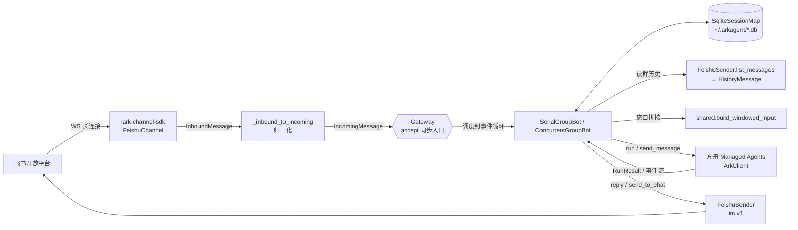
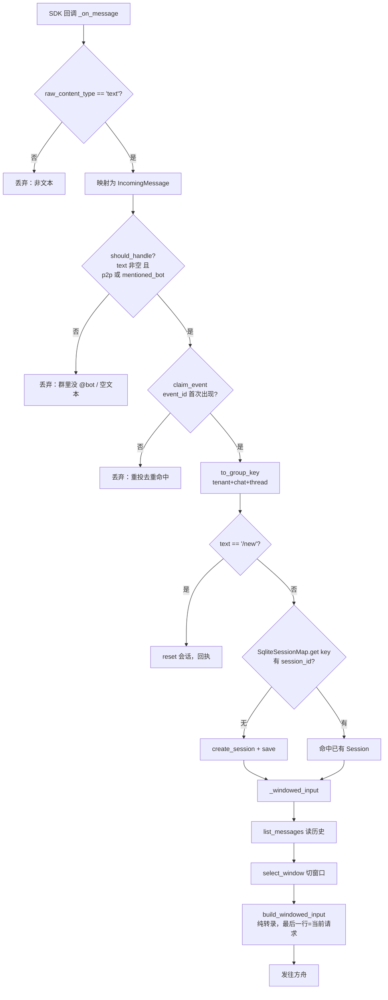
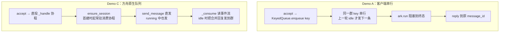
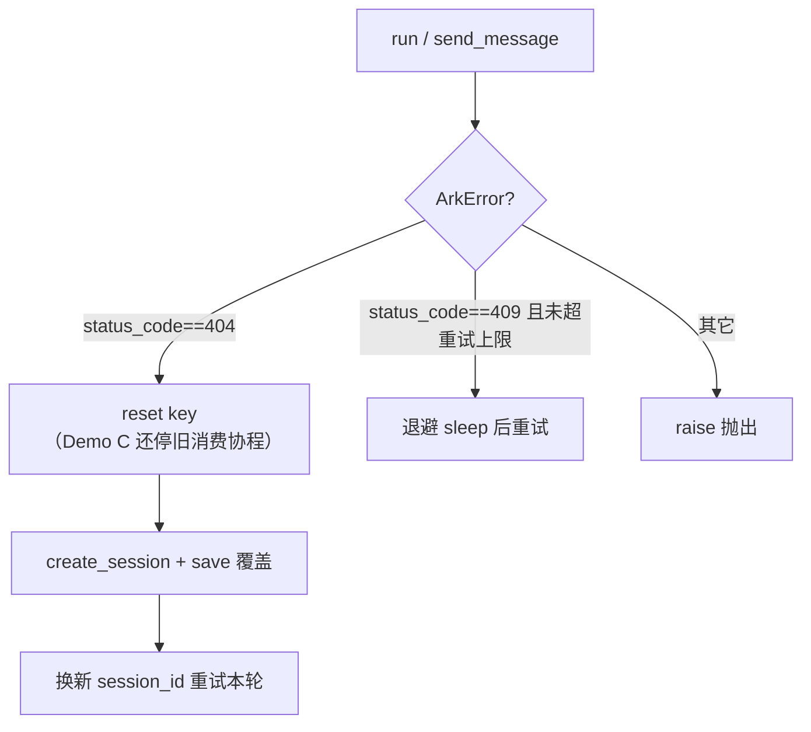

# 群聊共享 Bot：架构与数据流

这份文档回答三个问题：

1. 一条飞书消息从进来到回复，**数据是怎么流动的**（架构图 / 时序图）。
2. 流程里有哪些**关键数据结构**，各自装了什么。
3. 每个**判断节点依据对象的哪个属性**做决策。

代码入口：`shared.py`（公共底座）、`demo_a_serial.py`（方案 A 串行）、
`demo_c_native_queue.py`（方案 C 方舟原生队列）、`../../arkagent/feishu.py`（飞书接入 +
归一化）、`../../arkagent/ark.py`（方舟客户端）、`../../arkagent/gateway.py`（`KeyedQueue`）。

> 术语：**触发消息** = 当前这条 @bot 的入站消息；**窗口** = 注入本轮的那段群历史增量。

---

## 1. 关键数据结构

| 结构 | 定义位置 | 作用 | 关键字段 |
|---|---|---|---|
| `IncomingMessage` | [feishu.py:22](../../arkagent/feishu.py) | **单条入站消息的归一化契约**（接入层→业务的防腐层） | `event_id`（去重）、`chat_id`/`thread_id`/`tenant_key`（分桶）、`chat_type`、`mentioned_bot`（是否处理）、`message_id`（回复/筛历史）、`text`、`create_time`（窗口排序/截断）、`user_open_id` |
| `HistoryMessage` | [feishu.py:36](../../arkagent/feishu.py) | 一条**群历史**消息归一化后的结果，比入站多两个语义判定位 | `at_bot`（切窗口边界）、`is_from_bot`（过滤 bot 回复）、`create_time`（升序）、`sender_name`（转录显示名）、`text` |
| `GroupConversationKey` | [shared.py:35](shared.py) | 共享会话键，**刻意不含 user_open_id** | `tenant_key` + `chat_id` + `thread_id` → `as_str()` = `"t:chat:thread"` |
| `SqliteSessionMap` | [shared.py:343](shared.py) | 群 key → 方舟 session_id 的**持久化映射** + 事件去重，跨重启不丢 | 表 `sessions(key, session_id)`、`seen_events(event_id)` |
| `RunResult` | [ark.py:27](../../arkagent/ark.py) | 方舟一轮运行的终态结果 | `terminal`（`"idle"`/`"failed"`）、`messages` |
| `ArkError` | [ark.py:33](../../arkagent/ark.py) | 方舟异常，带**结构化状态码** | `status_code`（404=Session 失效、409=RuntimeBusy）、`body` |

---

## 2. 总体架构



出站与入站共用同一个 SDK：入站走 `FeishuChannel`（WS + 归一化 + 去重 + 策略），
出站走 SDK 自带的同步 `Client`（`FeishuSender`）。

---

## 3. 入站数据流与判断节点（从收到到发给方舟）



### 判断节点 → 依据属性 一览

| # | 判断节点 | 代码位置 | 依据属性 | 命中后的动作 |
|---|---|---|---|---|
| 1 | 是否文本消息 | `_inbound_to_incoming` [feishu.py:290](../../arkagent/feishu.py) | `msg.raw_content_type == "text"` | 否则返回 None、丢弃 |
| 2 | 是否处理这条 | `should_handle` [shared.py:59](shared.py) | `text` 非空 **且**（`chat_type=="p2p"` **或** `mentioned_bot`） | 群里没 @bot 直接丢 |
| 3 | 事件去重 | `claim_event` [shared.py:410](shared.py) | `event_id`（SQLite 主键唯一约束原子占位） | 重投则丢，跨重启仍生效 |
| 4 | 会话分桶 | `to_group_key` [shared.py:51](shared.py) | `tenant_key` + `chat_id` + `thread_id` | 决定共享哪个 Session；**话题独立成桶** |
| 5 | 指令分流 | `_process`/`_handle` | `text.strip() == "/new"` | 重置本群会话 |
| 6 | 是否已有 Session | `SqliteSessionMap.get` [shared.py:391](shared.py) | `key.as_str()` | 无则 `create_session` |
| 7 | 历史容器选择 | `list_messages` [feishu.py:240](../../arkagent/feishu.py) | `thread_id` 非空 → `thread` 容器；否则 → `chat` 容器（且用 `end_time` 截到当前） | 决定拉哪条时间线的历史 |
| 8 | 历史项筛选 | `_is_eligible_history` [feishu.py:424](../../arkagent/feishu.py) | `message_id != trigger.message_id` **且** `0 < create_time <= trigger.create_time` | 排除触发消息本身、排除并发到达的"未来"消息 |
| 9 | at_bot / is_from_bot | `normalize_history_item` [feishu.py:436](../../arkagent/feishu.py) | `mentions[].id == bot_open_id` / `sender_type=="app"` 或 `sender_open_id==bot_open_id` | 给历史项打上切窗/过滤标记 |
| 10 | 窗口边界 | `select_window` [shared.py:145](shared.py) | 历史项的 `is_from_bot`（先滤掉）、`at_bot`（取最近一条作为窗口起点） | 无 at_bot 时回退最近 `FALLBACK_WINDOW_MESSAGES`(10) 条 |

窗口规则的语义：「倒数第一次 @bot」= 当前触发消息（不在历史里）；「倒数第二次 @bot」
= 历史里**最近一条** `at_bot`。从它到现在，正好是上一轮触发点之后、尚未喂过 Session 的增量。

拼出的 user message 是**纯对话转录**（不再有 `<conversation_context>` 等 XML 包裹）：

```
Alice: 老板说要出周报
Bob: 我这边数据有了
ou-xxx: 整理成周报发我        ← 最后一行 = 当前 @bot 的请求（只有 open_id 可用时用它兜底）
```

---

## 4. 两个方案的分叉（发送策略 + 回复路径）



| 维度 | Demo A | Demo C |
|---|---|---|
| 排序者 | 客户端 `KeyedQueue`（[gateway.py:28](../../arkagent/gateway.py)，按 key 串行） | 方舟服务端"运行中待处理队列" |
| 是否合并 | 不会，每条独立成轮 | 会，同一可调度边界前堆积的多条被打包进一次模型请求 |
| 每人单独回复 | 是 | 不保证 |
| 回复路径 | `reply(message_id)`——**留在话题内** | `send_to_chat(chat_id)`——发新群消息，**在话题里触发时回复会跑到群主时间线** |
| 409 `RuntimeBusy` | 不触发 | 会，指数退避（`_is_runtime_busy` 依据 `ArkError.status_code==409`） |

> 判断节点（Demo A）：`_reply` 依据 `chat_type=="group"` **且** `message_id` 决定
> reply 原消息还是发群会话。

---

## 5. 兜底：Session 失效重建

持久化后，`session_id` 可能在方舟侧已过期/被清（重启后尤甚），表现为 **404**。



| 判断节点 | 位置 | 依据属性 | 动作 |
|---|---|---|---|
| Session 失效 | Demo A `_process` / Demo C `_post_message` | `ArkError.status_code == 404` | 重置映射 → 重建 Session → 重跑/重发 |
| 队列忙 | Demo C `_post_message` | `ArkError.status_code == 409`（`_is_runtime_busy`） | 指数退避重试（上限 `MAX_409_RETRIES`） |
| 运行终态 | `_result_to_text` [demo_a_serial.py](demo_a_serial.py) | `RunResult.terminal` / `messages` | `failed` 报错、`idle` 取最后一条 |

`ArkError.status_code` / `body` 由 `ArkClient._request` 与事件流在 4xx 时填充
（[ark.py:86](../../arkagent/ark.py)），调用方据此精准分流，不再靠字符串匹配。

---

## 6. 持久化落点

- `SqliteSessionMap` 默认落 `~/.arkagent/group_bot_sessions.db`（WAL 模式）。
- `sessions` 表让 gateway 重启后仍复用同一个群/话题的方舟 Session（对话记忆存在方舟侧）。
- `seen_events` 表让事件去重跨进程重启仍生效（24h TTL，启动清理一次）。
- 并发：WS 线程与事件循环线程共用连接（`check_same_thread=False`），进程内一把锁串行化写。
```

